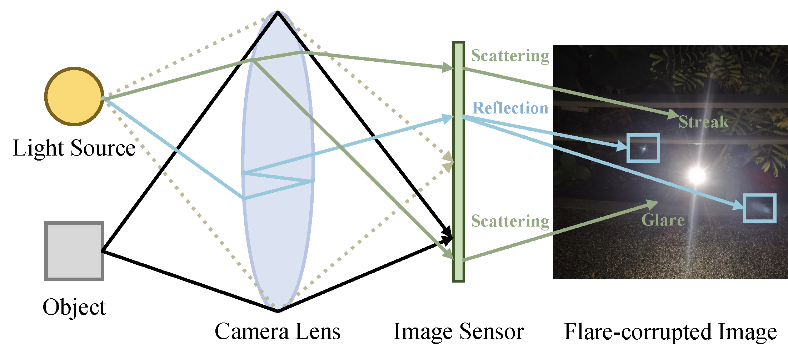

# Awesome-Deep-Learning-based-Flare-Removal-Methods
    

Collection of recent flare removal works, including datasets, papers, codes and metrics.

  

------

## Table of contents

- [Survey, Review & Challenge of flare removal](#Survey-of-flare-removal)
- [Flare removal datasets](#Flare-removal-datasets)
- [Unsupervised flare removal methods](#Unsupervised-flare-removal-methods)
- [Self-supervised flare removal methods](#Self-supervised-flare-removal-methods)
- [supervised flare removal methods](#supervised-flare-removal-methods)

------

## Survey of flare removal

| Year |       Publication        |                            Title                             |                            Paper                             |                        Project                        |
| :--: | :----------------------: | :----------------------------------------------------------: | :----------------------------------------------------------: | :---------------------------------------------------: |
| 2023 |         `ArXiv`          |            **Toward flare-free images: A survey**            |       **[[paper](https://arxiv.org/abs/2310.14354)]**        |                                                       |
| 2023 |         `ArXiv`          | **Toward Real Flare Removal: A Comprehensive Pipeline and A New Benchmark** |       **[[paper](https://arxiv.org/pdf/2306.15884)]**        |                                                       |
| 2023 | `CVPRW` `CCF A Workshop` | **Mipi 2023 challenge on nighttime flare removal: Methods and results** | **[[paper](https://openaccess.thecvf.com/content/CVPR2023W/MIPI/papers/Dai_MIPI_2023_Challenge_on_Nighttime_Flare_Removal_Methods_and_Results_CVPRW_2023_paper.pdf)]** | **[[project](https://mipi-challenge.org/MIPI2023/)]** |
| 2024 | `CVPRW` `CCF A Workshop` | **Mipi 2024 challenge on nighttime flare removal: Methods and results** | **[[paper](https://ieeexplore.ieee.org/document/10678229)]** | **[[project](https://mipi-challenge.org/MIPI2024/)]** |

## Flare removal datasets

| Year |   Publication   |                            Title                             |                            Paper                             |                      Dataset                      |
| :--: | :-------------: | :----------------------------------------------------------: | :----------------------------------------------------------: | :-----------------------------------------------: |
| 2022 | `NIPS` `CCF A`  | **Flare7k: A phenomenological nighttime flare removal dataset** | **[[paper](https://proceedings.neurips.cc/paper_files/paper/2022/file/1909ac72220bf5016b6c93f08b66cf36-Paper-Datasets_and_Benchmarks.pdf)]** | **[[dataset](https://github.com/ykdai/Flare7K)]** |
| 2023 |     `ArXiv`     | **Tackling scattering and reflective flare in mobile camera systems: A raw image dataset for enhanced flare removal** | **[[paper](https://ui.adsabs.harvard.edu/abs/2023arXiv230714180L/abstract)]** |                                                   |
| 2023 |     `ArXiv`     | **Toward Real Flare Removal: A Comprehensive Pipeline and A New Benchmark** |       **[[paper](https://arxiv.org/pdf/2306.15884)]**        |                                                   |
| 2024 | `TPAMI` `CCF A` | **Flare7k++: Mixing synthetic and real datasets for nighttime flare removal and beyond** |       **[[paper](https://arxiv.org/pdf/2306.04236)]**        | **[[dataset](https://github.com/ykdai/Flare7K)]** |

## Unsupervised flare removal methods

| Year |  Publication   |                            Title                             |                            Paper                             |                             Code                             |
| :--: | :------------: | :----------------------------------------------------------: | :----------------------------------------------------------: | :----------------------------------------------------------: |
| 2021 | `ICCV` `CCF A` | **Light source guided single image flare removal from unpaired data** | **[[paper](https://openaccess.thecvf.com/content/ICCV2021/papers/Qiao_Light_Source_Guided_Single-Image_Flare_Removal_From_Unpaired_Data_ICCV_2021_paper.pdf)]** | **[[code](https://github.com/tanmayj2020/LightSourceGuideSingleImageFlareRemoval-ICCV2021)]** |

## self-supervised flare removal methods
| Year |  Publication   |                            Title                             |                            Paper                             |                             Code                             |
| :--: | :------------: | :----------------------------------------------------------: | :----------------------------------------------------------: | :----------------------------------------------------------: |
| 2025 |        `AAAI` `CCF A`         | **Disentangle Nighttime Lens Flares: Self-supervised Generation-based Lens Flare Removal** |       **[[paper](https://arxiv.org/pdf/2502.10714)]**        |   **[[code](https://github.com/xhnshui/Flare-Removal)]**        |

## Supervised flare removal methods

| Year |          Publication          |                            Title                             |                            Paper                             |                             Code                             |
| :--: | :---------------------------: | :----------------------------------------------------------: | :----------------------------------------------------------: | :----------------------------------------------------------: |
| 2021 |        `ICCV` `CCF A`         |      **How to train neural networks for flare removal**      | **[[paper](https://openaccess.thecvf.com/content/ICCV2021/papers/Wu_How_To_Train_Neural_Networks_for_Flare_Removal_ICCV_2021_paper.pdf)]** | **[[code](https://github.com/budui/flare_removal_pytorch)]** |
| 2022 |        `NIPS` `CCF A`         | **Flare7k: A phenomenological nighttime flare removal dataset** | **[[paper](https://proceedings.neurips.cc/paper_files/paper/2022/file/1909ac72220bf5016b6c93f08b66cf36-Paper-Datasets_and_Benchmarks.pdf)]** |        **[[code](https://github.com/ykdai/Flare7K)]**        |
| 2023 |        `ICCV` `CCF A`         | **Improving lens flare removal with general-purpose pipeline and multiple light sources recovery** | **[[paper](https://openaccess.thecvf.com/content/ICCV2023/papers/Zhou_Improving_Lens_Flare_Removal_with_General-Purpose_Pipeline_and_Multiple_Light_ICCV_2023_paper.pdf)]** | **[[code](https://github.com/YuyanZhou1/Improving-Lens-Flare-Removal)]** |
| 2023 |   `CVPRW` `CCF A Workshop`    | **Hard-negative sampling with cascaded fine-tuning network to boost flare removal performance in the nighttime images** | **[[paper](https://openaccess.thecvf.com/content/CVPR2023W/MIPI/papers/Song_Hard-Negative_Sampling_With_Cascaded_Fine-Tuning_Network_To_Boost_Flare_Removal_CVPRW_2023_paper.pdf)]** |                                                              |
| 2023 |   `CVPRW` `CCF A Workshop`    | **Ff-former: Swin fourier transformer for nighttime flare removal** | **[[paper](https://openaccess.thecvf.com/content/CVPR2023W/MIPI/papers/Zhang_FF-Former_Swin_Fourier_Transformer_for_Nighttime_Flare_Removal_CVPRW_2023_paper.pdf)]** |                                                              |
| 2023 |        `CVPR` `CCF A`         | **Nighttime smartphone reflective flare removal using optical center symmetry prior** | **[[paper](https://openaccess.thecvf.com/content/CVPR2023/papers/Dai_Nighttime_Smartphone_Reflective_Flare_Removal_Using_Optical_Center_Symmetry_Prior_CVPR_2023_paper.pdf)]** |     **[[code](https://github.com/ykdai/BracketFlare)]**      |
| 2024 |       `ICASSP` `CCF C`        | **Flare-free vision: Empowering uformer with depth insights** | **[[paper](https://www.researchgate.net/profile/Marwan-Torki/publication/376586936_FLARE-FREE_VISION_EMPOWERING_UFORMER_WITH_DEPTH_INSIGHTS_ICASSP2024/links/657ea3058e2401526dde1e84/FLARE-FREE-VISION-EMPOWERING-UFORMER-WITH-DEPTH-INSIGHTS-ICASSP2024.pdf)]** | **[[code](https://github.com/yousefkotp/Flare-Free-Vision-Empowering-Uformer-with-Depth-Insights)]** |
| 2024 | `The Visual Computer` `CCF C` | **Mfdnet: Multifrequency deflare network for efficient nighttime flare removal** | **[[paper](https://link.springer.com/article/10.1007/s00371-024-03540-x)]** | **[[code](https://github.com/Jiang-maomao/flare-removal)]**                                                             |
| 2024 |            `ArXiv`            | **Harmonizing Light and Darkness: A Symphony of Prior-guided Data Synthesis and Adaptive Focus for Nighttime Flare Removal** |       **[[paper](https://arxiv.org/pdf/2404.00313)]**        | **[[code](https://github.com/qulishen/Harmonizing-Light-and-Darkness)]** |
| 2024 | `Pattern Recognition` `CCF B` | **Gr-gan: A unified adversarial framework for single image glare removal and denoising** | **[[paper](https://www.sciencedirect.com/science/article/pii/S0031320324005661)]** |                                                              |
| 2024 |        `BMVC` `CCF C`         | **Difflare: Removing image lens flare with latent diffusion model** |       **[[paper](https://arxiv.org/pdf/2407.14746)]**        |    **[[code](https://github.com/TianwenZhou/Difflare)]**     |
| 2024 | `BMVC` `CCF C` | **GN-FR: Generalizable Neural Radiance Fields for Flare Removal** | **[[paper](https://arxiv.org/pdf/2412.08200)]** |  |
| 2024 |      `IEEE TIP` `CCF A`       | **Towards blind flare removal using knowledge-driven flare-level estimator** | **[[paper](https://ieeexplore.ieee.org/abstract/document/10726687)]** |                                                              |
| 2025 |      `IEEE TCSVT` `CCF B`      | **LPFSformer: Location Prior Guided Frequency and Spatial Interactive Learning for Nighttime Flare Removal** | **[[paper](https://ieeexplore.ieee.org/document/10777570)]** |                                                              |
| 2025 |      `IEEE TASE` `CCF B`      | **Self-prior Guided Spatial and Fourier Transformer  for Nighttime Flare Removal** | **[[paper](https://ieeexplore.ieee.org/abstract/document/10877847)]** |        **[[code](https://github.com/cranbs/SGSFT)]**         |
| 2025 |        `EAAI` `CCF C`         | **A self-prompt based dual-domain network for nighttime flare removal** | **[[paper](https://www.sciencedirect.com/science/article/abs/pii/S0925231225007726)]** |                                                              |
| 2025 |   `Neurocomputing` `CCF C`    |        **Mask-Q attention network for flare removal**        | **[[paper](https://www.sciencedirect.com/science/article/abs/pii/S0952197625001034)]** |                                                              |
| 2025 |   `Neural Networks` `CCF B`   | **When low-light meets flares: Towards Synchronous Flare Removal and Brightness Enhancement** | **[[paper](https://www.sciencedirect.com/science/article/abs/pii/S0893608025000280)]** |                                                              |
| 2025 |       `ICASSP` `CCF C`        |            **Flare-Aware RWKV for Flare Removal**            | **[[paper](https://ieeexplore.ieee.org/document/10888487)]** |                                                              |
| 2025 |        `Expert Systems with Applications` `CCF C`       | **IllumiNet: A two-stage model for effective flare removal and light enhancement under complex lighting conditions** |       **[[paper](https://www.sciencedirect.com/science/article/pii/S0957417425012606)]**        |  
| 2025 |        `TPAMI` `CCF A`       | **Image Lens Flare Removal Using Adversarial Curve Learning** |       **[[paper](https://ieeexplore.ieee.org/document/10989553)]**        | [[code](https://github.com/YuyanZhou1/Improving-Lens-Flare-Removal)] |
| 2025 |        `TCE`       | **Nighttime Glare Removal for Consumer Electronics via Latent Space Transformation and Feature Enhanced Attention Mechanism** |       **[[paper](https://ieeexplore.ieee.org/abstract/document/11006158)]**        |   |

